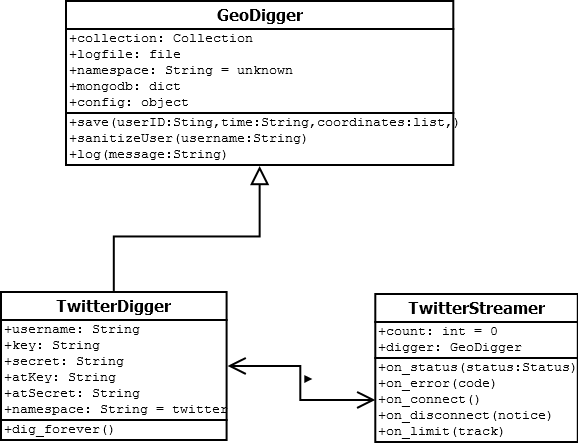

*Note: This document was automatically generated by
[onepage.sh](onepage.sh). As a result, some links may be broken.*

GeoDigger
=========

## Introduction

The goal of this project is to develop a tool that collects publicly
available location information from social network services, such as
Twitter and Foursquare. These social network services allow users to tag
posts with their current location. By listening to the public streams of
data that these services provide, it is possible to build a database of
location information, an invaluable data source for human mobility
research.

## Technologies

In order to develop a tool that would let researchers easily create
datasets of location information, several existing technologies had to be
researched and put to use.

* Python:
    The tool itself is written in Python, an object-oriented interpreted
    language with a large number of community-developed extensions.
* [Twitter APIs](#twitter):
    Application programming interfaces that allow applications to
    control Twitter services and access Twitter data.
* [Tweepy](#tweepy):
    A Python module that allows us to use the Twitter API.
* [MongoDB](#mongodb):
    A non-relational, document-oriented database designed to allow for
    efficient storage and searching of large datasets.
* [PyMongo]#pymongo:
    A Python module that allows us to use a Mongo database server.
* [GeoJSON](#geojson):
    A format used to encode geographical information.
* [Pyramid](#pyramid):
    A Python web framework used to create a web-based frontend for the
    GeoDigger project.

## GeoDigger

The GeoDigger Python script represents the end product of this research
project. It allows researchers to easily aggregate geotagged data points
from social network users, and is extensible to allow collection from
more social networks than those which have already been implemented.

[More](#geodigger)

### TwitterDigger

This module adds support to GeoDigger for using the Twitter streaming
API.

[More](#twitterdigger)

## Postprocessor

A non-negligable amount of posts collected from these social networking
data sources is created by "bots," software designed to post status
updates, often for commecrial purposes. In order to filter out these
posts and obtain more accurate human mobility data, a postprocessing
tool was designed to delete suspicious posts from the database.

[More](#postprocessor)

## GeoDigger UI

The GeoDigger web frontend allows researchers to filter data based on
time, location, and other parameters, and convert raw data points in
a database to normalized CSV output.

[More](#ui)

# Twitter API
Twitter is a popular microblogging platform, with over 230 million
active users [[1]](https://about.twitter.com/company). It provides a
number of APIs, or application programming interfaces, that allow
developers to use various Twitter services. These APIs come in two
flavors: one a traditional REST API, and the other a "streaming" API
that allows live data consumption [[2]](https://dev.twitter.com/docs/api)
[[3]](https://dev.twitter.com/docs/streaming-apis).

## Traditional vs streaming APIs
In order to use a traditional REST API, an application must send HTTP
requests to a server and listen for responses. This is ideal for
applications that wish to post Twitter status updates, change settings,
or retrieve data at regular intervals. For developers that need access
to live data, Twitter provides a set of streaming APIs, which are more
suited for data mining applications than their REST counterparts.
To use one of the streaming APIs, an application simply authenticates
to the desired stream, sets up an HTTP connection, and waits. Twitter's
servers then push data to the application in real time, throttling the
number of status updates sent based on available bandwidth or the
streaming cap whenever necessary
[[4]](https://dev.twitter.com/docs/faq#6861).

## Public streams and the filter endpoint
Twitter offers three streaming APIs for use by developers
[[3]](https://dev.twitter.com/docs/streaming-apis). The first,
which is the most useful for data minging applications, is the public
stream. This API allows applications to read from a subset of all public
data flowing through Twitter. The other streaming APIs, the user stream
and the site stream, are geared towards developers who are writing an
application that provides some sort of service to Twitter users. Within
the public streaming API are three "endpoints," which are used to
determine what messages the appliaction wishes to recieve
[[5]](https://dev.twitter.com/docs/streaming-apis/streams/public).
The "sample" endpoint returns a small, random subset of all data, while the
"firehose" endpoint returns all status updates that pass through
Twitter. The endpoint that is most useful for human mobility
researchers is the "filter" stream, which allows developers to query for
status updates that match a certain filter or filters. One filtering
option limits returned statuses to only those that contain geolocation
data [[6]](https://dev.twitter.com/docs/api/1.1/post/statuses/filter).
This "filter" endpoint of the public streaming API is what the twitter
portion of the GeoDigger application uses to collect geotagged status
updates from Twitter users.

## OAuth
Since the filter endpoint of the public streaming API requires user
context [[6]](https://dev.twitter.com/docs/api/1.1/post/statuses/filter),
an important step in establishing a connection to the API is
authenticating as a certain user. The current version of the Twitter API
requires applications to authenticate using OAuth, and open
authentication protocol considered more secure than the HTTP "Basic"
authentication scheme supported by previous versions of the Twitter API
[[7]](http://oauth.net/). OAuth authentication relies on a set of tokens
and keys, which can be obtained by setting up a Twitter account and
registering an application [[8]](https://dev.twitter.com/docs)
[[9]](https://dev.twitter.com/apps).

## Tweet and User objects
The data sent to clients from the Twitter API consists of a number of
objects, two of which are used by this project. The first object is the
"Tweet," or status update
[[10]](https://dev.twitter.com/docs/platform-objects/tweets).
Tweets have a number of fields, some of which contain other embedded
objects. The fields used by GeoDigger are "created_at", which contains a
date and time value that is supposed to be the time the Tweet was
created; "coordinates," which contains a [GeoJSON](#geojson) point;
and "user," which contains an embedded User object. User objects
themselves have a large number of fields
[[11]](https://dev.twitter.com/docs/platform-objects/users), but the
only one of interest to us is the "id_str" field, which is a string
representation of the unique integer identifier for the user who created
the Tweet. According to the Twitter documentation for the User object,
the integer ID number itself "is greater than 53 bits and some
programming languages may have difficulty/silent defects in interpreting
it." Developers are encouraged to "Use id_str for fetching the identifier
to stay on the safe side,"
[[11]](https://dev.twitter.com/docs/platform-objects/users) rather than
using the "id" field on the User object and risking an integer overflow
or other similar error.

Tweepy
======

## lack of documentation, but twitter api highly documented
## setting up a listener
## OAuth

MongoDB
=======

MongoDB is a popular non-relational document-oriented database designed
to store large amounts of information. [[1]](http://www.mongodb.org/)
MongoDB's support for storing and querying from vast datasets, along
with its built-in support for [GeoJSON](#geojson) make it a perfect
match for this project. When using a MongoDB server, it is important to
make sure that the machine on which the server runs has a 64-bit
processor. If this is not the case, the MongoDB server will only be able
to store up to two gigabytes of data, which will severely limit its
usefulness. In experiments run during the development of GeoDigger's
Twitter functionality, it took approximately two days of saving data
from the Twitter streaming API to reach this two gigabyte storage limit.

## Tables, Collections, and Indices

## Geospatial Support

## PyMongo

PyMongo is a well documented Python module, or library, that allows
developers to interact with [Mongo](#mongodb) databases
[[1]](http://api.mongodb.org/python/current/).

### Applications in GeoDigger

PyMongo is used in the GeoDigger base class to allow child classes to
easily store correctly formatted data to a database. It is also used
more extensively in the GeoDigger web interface.

...

### BSON
MongoDB stores data in a format known as BSON
[[2]](http://bsonspec.org/), or Binary JSON [[3]](http://json.org/). This
structured binary encoding format can very efficiently store data, but
it is not directly compatible with Python. For this reason, the
developers of PyMongo ship a seperate *bson* Python library with their
PyMongo distribution. This allows users of PyMongo to access the full
functionality of MongoDB.

## Queries and Aggregation

GeoJSON
=======

GeoJSON is "a format for encoding a variety of geographic data
stuctures." [[1]](http://geojson.org/) This format, which is fully
supported by [MongoDB](#mondodb), allows us to run extremely flexible
queries on the data that the GeoDigger tool collects. Data is saved into
our database as a number of GeoJSON "points", each consisting of a
latitude and longitude:

    {
        type: "Point",
        coordinates: [0.5, 0.5]
    }

If we then instruct MongoDB to treat this as a point on a
two-dimensional sphere, it allows us to run queries on our data with
this in mind. We can define a polygon of an arbitrary size and shape by
specifying its vertices, then pass this polygon to MongoDB and ask it to
return all data points that fall within this polygon. Alternatively, we
can query for all data points that lie within a certain radius of a
givern GeoJSON point.
[[2]](http://docs.mongodb.org/manual/applications/geospatial-indexes/)

The GeoJSON support provided by MongoDB makes deriving useful
geographical information from our dataset much easier.

# GeoDigger

## The GeoDigger class

The GeoDigger class acts as a parent, or base class, which can be
extended by creating derivative child classes. This parent class has
four main functions: reading from the global configuration file and
setting up member variables based on its contents, setting up a
connection to a MongoDB database server and saving information to this
server, sanitizing user IDs to remove identifiable information while
retaining a unique value, and writing timestamped messages to a log file
to keep track of API connections, errors, and other possibly useful
information.

## Configuration and constructor

In order to facilitate code reuse, configuration for the tool is stored
in a seperate file. The GeoDigger constructor reads from this file and
sets up member variables that are used to connect to the database, write
to a log file, and read from social networking APIs. These variables are
accessible to all methods in the GeoDigger class, as well as all
GeoDigger subclasses, but most of them are only used by the base
GeoDigger class. The exception is `config`, an object that represents
all the information stored in the configuration file. Subclasses read
API connection infotmation from attributes of this object (eg,
`config.twitter`). The GeoDigger constructor also sets up a connection
to the MongoDB server defined in the configuration file, and ensures
that a "collection" with the necessary parameters is defined on the
server. Finally, the constructor sets up a member variable called
`namespace`, with a default value of "unknown", which should be
overridden by the child class. This variable is used to determine the
source from which a data point originated, to facilitate querying data
based on source. It is also used in the user ID sanitizing method to
ensure that, for example, user #312 from Twitter (namespace "twitter")
recieves a different unique identifier than user #312 from Facebook
(namespace "facebook").

## Saving to the database

Regardless of the data source being queried, each child class needs the
ability to save the information it gathers to a central database. The
GeoDigger class provides this functionality with its `save()` method.
This method takes a unique user identifier, a timestamp (assumed to be
the time a specific data point was created by the user), and an ordered
list in `[longitude, latitude]` format that tells the position from
which the data point originated. It then inserts this information into
the database as a MongoDB "document" in the correct format, along with
the "namespace" variable defined by the child class. The fact that this
method is included in the parent class means that children need to know
absolutely nothing about the database.

## User ID sanitizing

When collecting data, it is important to ensure that each user can be
uniquely identified and tied to his or her own data points. However, as
is often the case in human mobility research, user privacy is a concern
here. Since GeoDigger pulls from public social networking APIs, it might
be acceptable to simply assume that privacy is not an issue for these
users, who have chosen to opt in to publicly share their geolocation
information. This said, an effort was still made to protect the privacy
of these users. Each unique user identifier passed into the
`anonymizeUser()` method of the GeoDigger class is combined with the
namespace of the child class and passed through a one-way hashing
algorithm, SHA512. This provides us with a suitably unique identifier to
associate with data points, while abstracting from the original ID.

## Logging

The final function of the GeoDigger class is to privide logging
functionality. Knowing how many data points from an API have been
dropeed due to slow network speeds, when an API connection was created,
dropped (perhaps due to network errors), or resumed might be extremely
important information. Assume for simplicity that a researcher is
attempting to analyze data obtained over a single week. If an API
connection was established on Monday of that week and continued until
Wednesday, when a network disruption caused the connection to be lost
for several hours, and finally resumed on Thursday and continued without
interruption until the end of the week, a sizeable amount of data might
have been collected. Without a log, the researcher might assume data was
being collected during the entire week, and any analasys performed would
be skewed due to the missing data. The GeoDigger log accounts for this
problem by allowing child classes to write date and timestamped messages
to a central log file whenever something of importance occurs in the
process of reading from the API. Timestamps are added automatically, so
child classes only need to call the logging method as `log("message")`.

## Usage

Users interested in collecting their own data with GeoDigger will first
have to register for whatever social network services they want to use
and collect the necessary authentication information.

   ...

## Extending

GeoDigger was designed with extensibility in mind. A single parent class
takes care of interfacing with the database server and sanitizing unique
user IDs. Specialized child classes such as TwitterDigger take care of
reading from a single API, using the `save()` method from the GeoDigger
parent class to store information to a local database, and the `log()`
method to provide timestamps for connection attempts, errors, and other
information that might be of use.

Adding support for additional social network service APIs is
straightforward - just take a look at TwitterDigger.py for example
code.

